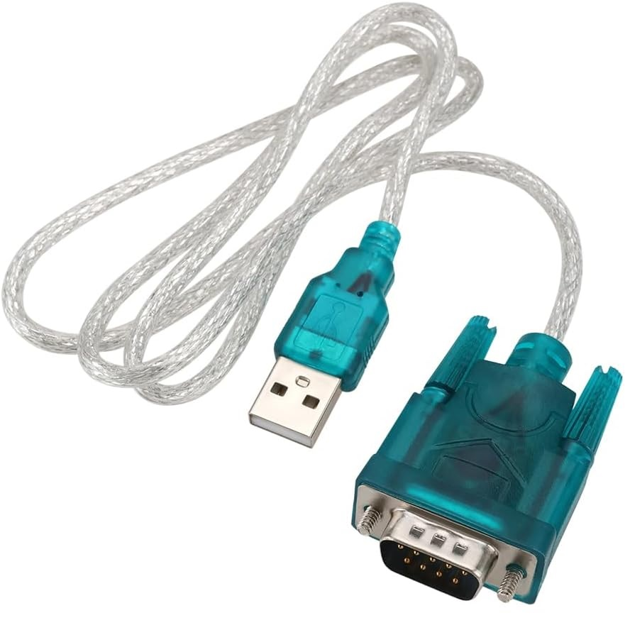

# Experimental Control Software for SGC SG-2000 Radio

Welcome to the experimental control software for the **SGC SG-2000 Radio**, developed as a proof-of-concept for interacting with the radio using a serial connection. 
This project is designed to provide an intuitive interface for controlling your SGC SG-2000 using Python and Tkinter.

  

*SG-2000 Radio - SGC manufactured HF amateur radio equipment for more than 50 years. The company went out of business in 2022.*

---

## Features
- Simple GUI for interacting with the radio - it let set frequency and simply move step-by-step to scan a band
- Written in Python using Tkinter for cross-platform compatibility.
- Buildable as standalone executables for both Windows and Linux.
- Supports a 7-segment-style LCD font for a more authentic display experience.

---

## Prerequisites

### Hardware
1. **SGC SG-2000 Radio** with a functional serial port.

2. **USB-to-Serial Adapter** (CH340-based or compatible).
   
  

*Example of a USB-to-Serial dongle (CH340-based)*

### Software
1. **Driver for CH340 Chipset**:
   - [Download for Windows](https://sparks.gogo.co.nz/ch340.html)
   - Available on most Linux distributions (package: `ch341` or `ch340`).
2. **Python** (version 3.9 or newer).
3. **Conda** (optional, for virtual environment management).

---

## Installation Guide

A packaged Windows executable can be found here:

[Download for Windows](dist/sg2000_ux_1.exe).  

**Note:** Some antivirus software may flag the downloaded `.exe` file as suspicious or block it entirely. This is often a false positive, especially for executables generated using tools like PyInstaller. If this occurs, you may need to whitelist the file in your antivirus settings or download it on a system with less restrictive policies. Always ensure you trust the source of the file before overriding any warnings. In any case you can rebuild the software locally downloading source code from the repository.

### Step 1: Set Up a Virtual Environment
Using Conda (recommended):
```bash
conda create -n sgc2000 python=3.9 -y
conda activate sgc2000
```

Alternatively, with venv:

```bash
python -m venv sgc2000
source sgc2000/bin/activate  # On Windows: sgc2000\Scripts\activate
```
Step 2: Install Dependencies
Ensure pip is updated:

```bash
pip install --upgrade pip
```

### Install required Python packages:

```bash
pip install -r requirements.txt
```

Step 3: Install the LCD 7-Segment Font
Download the WooveboxSegment7  included in this repository.

**Install it on your system:**
Windows: Right-click the .otf file and select Install.
Linux: Copy the .otf file to ~/.fonts/ or /usr/share/fonts/.

### Running the Software

Launch the application by running:

```bash
python sg2000_ux_1.py
```
The software will start showing a panel and provide basic controls for the SGC SG-2000. 
Ensure your device is powered on and connected via the serial dongle.

###Building Executables
You can create standalone executables for Windows or Linux using the provided scripts:

Windows Build:
```bash
build_windows.bat
Linux Build:
bash
build_linux.bat
```
Executables will be generated in the dist/ directory.

### Basic operating instructions

  

This interface is designed to control and regulate the frequency settings of your SGC SG-2000 device. Follow these steps carefully for optimal operation.

#### 1. Select the COM Port
Purpose: Connect the interface to the device.
How-to:
This is the first required setting to operate. Locate the Select COM Port dropdown menu in the middle section of the interface.
Click the dropdown menu to display available COM ports.
Choose the appropriate COM port for your device connection.
In windows check "Device management" control panel to identify the CH340 auto-configured port in the system.
#### 2. Set the Frequency
Purpose: Adjust the frequency for the SGC SG-2000.
How-to:
The selected digit is marked in red.
Use the up (▲) and down (▼) arrow buttons on the right of the frequency display to adjust the frequency incrementally by the selected digit.
Alternatively, use the left (◄) and right (►) arrow buttons below the frequency to change the selected digit.
On certain O/S the mouse wheel can be used for the digit change.
#### 3. Select the Band
Purpose: Configure the band based on your operational requirements.

How-to: Locate the band dropdown menu under the frequency display.
Select the desired band from the list (e.g., "40m" for 40 meters). The relative frequency will be changed accordingly.
#### 4. Select the Mode
Purpose: Set the transmission mode.

How-to: Use the mode dropdown menu below the band selection.
Choose the appropriate mode (e.g., "USB" for Upper Side Band).
NOTE: at the minute only few modes where identified due to a lack of information in the original specification documents.
#### 5. Send the Frequency
Purpose: Apply the configured frequency and settings to the device.

How-to: Press the Send button after making your selections.
Ensure the device is properly configured and responding.
#### 6. Enable Autosend (Optional)
Purpose: Automatically send frequency changes to the device.

How-to: Check the Autosend checkbox.
Any change in frequency, band, or mode will now be sent automatically.
#### 7. Start a Frequency Scan (Optional)
Purpose: Scan through frequencies automatically.

How-to: Click the Start Scan button.
Adjust the Scan Delay (ms) field to set the delay between frequency changes (e.g., set "1000" apply 1-second delay). The delay is always applied also when you use the normal "Send" button.
Stop the scan by pressing the Start Scan button again.


**Important Notes**
Always select the correct COM port before attempting to adjust frequency or other settings.
Ensure your SGC SG-2000 is powered on and connected to the computer via the selected COM port.
Double-check all settings (band, mode, and frequency) before pressing the Send button.
For safety, avoid rapid or excessive changes in frequency during operation. We tested successfully 1 second of delay between commands.
If you encounter any issues, refer to the troubleshooting section of the SGC SG-2000 manual or contact technical support.

### Known Issues and Future Improvements

#### Known Issues:
Mode/band selections are not properly implemented.
Limited error handling for serial communication.
Interface optimizations needed for different type of screens.

#### Planned Features:
Correct/fix band selection parameters
Pick up starting frequency from downstream messages received from the radio
Identify and apply modes on the radio

**Disclaimer:**  
This project is experimental, and contributions are welcome! Feel free to fork the repository, open issues, or submit pull requests.
This software is provided "as is." 
We do not assume any responsibility for potential issues, including but not limited to hardware damage, data loss, or software conflicts, that may arise from its use. 
Use at your own risk.

### License
This project is licensed under the MIT License. See the LICENSE file for details.
Thank you for testing and improving this experimental software!

### Thanks
Many thanks to Alfredo Fabris (IZ2ADM) who has actively supported this project and Catullo - who has offered his SG2000 radio for testing the application.